# Installation Guide


## Installation Pre-Requirements

1. Maven 3.6.0, or higher
2. Java SDK 11 
3. Oracle Functions SDK and that the user has followed the [Oracle Functions Quickstart](https://www.oracle.com/webfolder/technetwork/tutorials/infographics/oci_faas_gettingstarted_quickview/functions_quickview_top/functions_quickview/index.html) and deployed, and executed, a simple *HelloWorld* function.
4. An Oracle SaaS Subscription. The current example code uses [Oracle Sales Cloud](https://www.oracle.com/applications/customer-experience/sales/sales-force-automation.html)(CRM) and assumes users are able to query/edit Sales Cloud Opportunities
5. Oracle OCI Subscription with access to Oracle OCI API Gateway, Oracle Functions and Oracle Key Management Services.
6. [Oracle Identity Cloud Service](https://www.oracle.com/cloud/security/cloud-services/identity-cloud.html)(IDCS) instance associated with Oracle Fusion Applications

## Configure Oracle IDCS 

For the solution to work we need to create a Confidential Application within Oracle Identity Cloud Service(IDCS). This must be the same Identity Management which is associated with Oracle Fusion otherwise the tokens issued by IDCS wont be acceptable by Oracle Fusion SaaS. 

Within IDCS there is already a confidential application setup, which in theory we could reuse, however to ensure upgradeability we recommend creating a new confidential application which exposes the same resources defined in the standard Oracle Fusion IDCS application.

1. Navigate to your Identity Management Console and create a new *confidential application*
2. Within the client configuration of the confidential application ensure:
   * Allowed grant types include "*Resource Owner*", "*Client Credentials*" and "*JWT Assertion*"
   
   * Within Resources click the "Add Scope" button and the scope from the "Oracle Applications Cloud(Fusion)" application. 
     
     Hint: It will be called something like "urn:opc:resource:consumer::all"
     
     The resulting scope name displayed(combined) will be something like ```urn:opc:resource:fa:instanceid=1234567urn:opc:resource:consumer::all```    
     
     ​     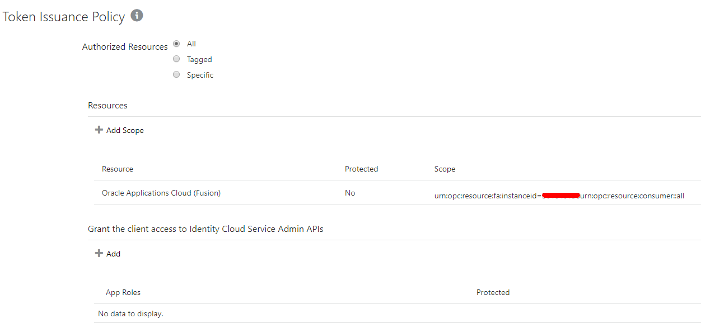


​     
   * Save and Activate the IDCS confidential application
     
   * Take note of the newly created application ***clientId***, ***client secret*** and ***scope name*** 
     
     

## Deploying the code
### Configure Security policies for API Gateway, Oracle Functions and Key Management

#### Configure Security Policies for Functions Deployment

Instructions for setting up security policies for the deployment, and execution, of Oracle Functions can be found in the Oracle Functions getting started guide. We recommend the user follows the Oracle Functions quick-start before continuing.

#### Configure Security Policies for API Gateway

The Following IAM Security Policies will need to be setup. In these example we have granted access to the API Gateway to the OCI Administrators, you should modify this as per your user security requirements.

| Policy Type    | Policy                                                       | Usage |
| -------------- | ------------------------------------------------------------ | ----- |
| Dynamic Policy called "APIGW_DYN_GRP" | ALL {resource.type = 'ApiGateway', resource.compartment.id = '**YOUR_COMPARTMENT_OCID**'} | Dynamically defines all API Gateway instances within the given compartment |
| Policy         | Allow group **Administrators** to manage api-gateway-family in compartment <**YOUR_COMPARTMENT_NAME**> | Allow administrators the ability to manage api gateways in the compartment |
| Policy         | Allow group **Administrators** to read virtual-network-family in compartment <**YOUR_COMPARTMENT_NAME**> | Allow administrators the ability to read VCNs in the compartment |
| Policy         | Allow group **Administrators** to read functions-family in compartment <**YOUR_COMPARTMENT_NAME**> | Allow administrators the ability to manage read functions in the compartment |
| Policy         | Allow dynamic-group **APIGW_DYN_GRP** to use virtual-network-family in compartment <**YOUR_COMPARTMENT_NAME**> | Allow administrators the ability to manage use VCNs in the compartment |
| Policy         | Allow dynamic-group **APIGW_DYN_GRP** to use functions-family in compartment <**YOUR_COMPARTMENT_NAME**> | Allow administrators the ability to use functions in the compartment |
| Policy         | Allow dynamic-group **APIGW_DYN_GRP** to manage public-ips in compartment <**YOUR_COMPARTMENT_NAME**> | Allow administrators the ability to manage IP addresses in the compartment |

#### Configure Security Policies for KMS Access

The Following IAM Security Policies need to be setup

| Policy Type | Policy         | Usage |
| ----------- | -------------- | ----- |
| Dynamic Group called "FN_DYN_GRP" | ALL {resource.type='fnfunc', resource.compartment.id='<**YOUR_COMPARTMENT_OCID**>'} | Dynamically defines all Function instances within the given compartment |
| Policy         | Allow dynamic-group **FN_DYN_GRP** to manage vaults in compartment <**YOUR_COMPARTMENT_NAME**> | Allow access the KMS Vaults |
| Policy         | Allow dynamic-group **FN_DYN_GRP** to manage keys in compartment <**YOUR_COMPARTMENT_NAME**> | Allow access the keys in KMS |
| Policy         | Allow dynamic-group **FN_DYN_GRP** to manage key-delegate in compartment <**YOUR_COMPARTMENT_NAME**> | Allow access the key delegates in KMS |

### Deploying the code using Terraform

A Terraform script is provided that creates the required network, API GW, Function, Vault, etc. The only pre-requisite to running the script is to build the function code and push it to the OCIR repository

#### Deploy Functions

**IMPORTANT :** Ensure you have the Oracle Functions SDK installed, configured and you have successfully deployed a sample function. For more information refer to the [Oracle Functions quickstart](https://www.oracle.com/webfolder/technetwork/tutorials/infographics/oci_faas_gettingstarted_quickview/functions_quickview_top/functions_quickview/index.html)

1. Compile the sources and push the images to the repository for each of the functions directories (e.g. gwauthtest, idcs_ocigw and saasopportunitiesfn)

   - Before deploy Functions, navigate to *idcsOAuthAsserter* directory and execute ```mvn clean install``` to generate a required dependency for *saasopportunitiesfn* Function
   - Navigate to *saasopportunitiesfn* directory and execute ```mvn clean package``` before deploy it to populate needed files for this Function in *saasopportunitiesfn/lib* directory
   - Navigate each directory and execute ```fn build  followed by fn push

#### Run the Terraform script

The script will create all the required OCI resources needed.  However, prior to executing the script a shell script needs to be created will all of the required details for your OCI environment.

1. Edit the setvars.sh script, setting the following values:

| Variable name            | Required value                                               |
| ------------------------ | ------------------------------------------------------------ |
| TF_VAR_tenancy_ocid      | OCID for your OCI tenancy                                    |
| TF_VAR_user_ocid         | OCID of your user ID                                         |
| TF_VAR_fingerprint       | Private key fingerprint                                      |
| TF_VAR_private_key_path  | Path to your private key                                     |
| TF_VAR_region            | OCI region where the resources will be created               |
| TF_VAR_compartment_ocid  | OCID for the compartment where the resources will be created |
| TF_VAR_name_prefix       | Prefix used for the names of all resources created to allow running this script multiple times in the same compartment with different names. |
| TF_VAR_region_code       | Oracle Registry region code, should be equivalent to region above |
| TF_VAR_tenancy_namespace | The namespace for your tenancy                               |
| TF_VAR_repos_name        | The name of the OCIR repository for pushing functions        |
| TF_VAR_debug_level       | Can be FINE,FINEST,INFO                                      |
| TF_VAR_fusion_hostname   | e.g. https://myfainstance.fa.em2.oraclecloud.com             |
| TF_VAR_idcs_app_clientid | Obtained from IDCS console                                   |
| TF_VAR_idcs_app_secret   | This was generated in the previous step after setting up the Key Management service. |
| TF_VAR_idcs_app_scopeid  | You get this value from looking at the Oracle Applications (Fusion) application in IDCS, within the configuration/resource section. The field is called "primary audience", and will normally look like ```urn:opc:resource:fa:instanceid=1234567``` |
| TF_VAR_idcs_app_url      | e.g https://idcs-XXXXXXXXXXXX.identity.oraclecloud.com       |

2. Run terraform init, if it hasn't previously been run in this directory
3. Run terraform plan. This will validate the script and show what changes will be applied, but won't actually apply them.
4. Run terraform apply to apply those changes and create the required resources.

### Deploying the code using manual steps

#### Configure Networking for OCI API Gateway and Oracle Functions

- Create a new virtual cloud network with Internet connectivity.  You can either create this manually or you can use the new Networking quick-start

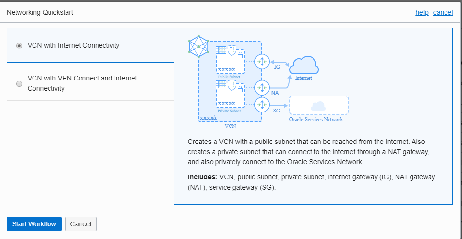

- The quick start creates regional public and private subnets, NAT gateway, Service Gateway and the associated routes/security lists. We only need the public subnet and some of the other artifacts can be removed

- Add inbound HTTPS(port 443) to the default security list to the public subnet(We need this because our incoming requests will all be on HTTPS)

  #### 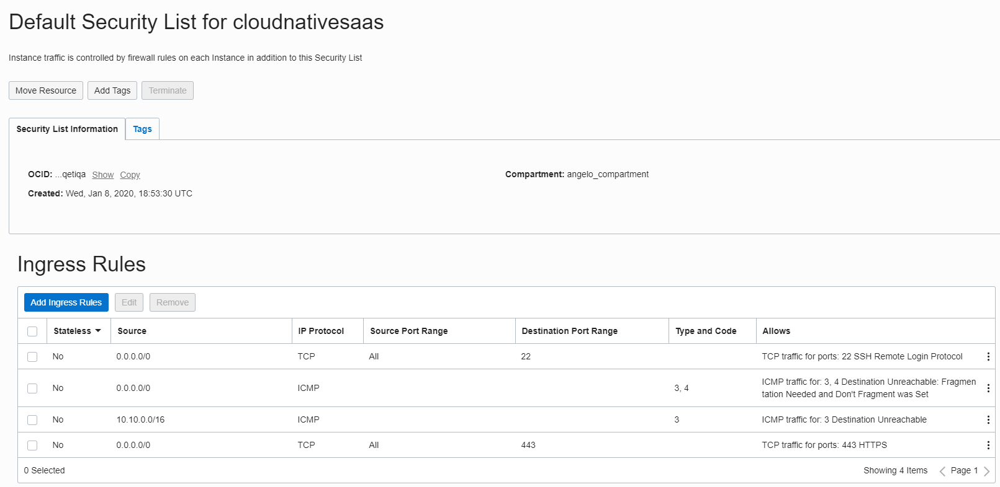


#### Configure Key Management Vault to store OAuth Client Secret

To protect the OAuth Client Secret, in this example we have opted to store the OAuth Client Secret within the Oracle KMS Vault. 

1. Navigate to Key Management administration in OCI Console 

2. Create a new Vault 

   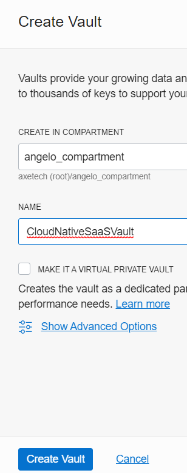

   

3. Within the vault create a new Key called "cloudnativesaas_oauthsecret"

   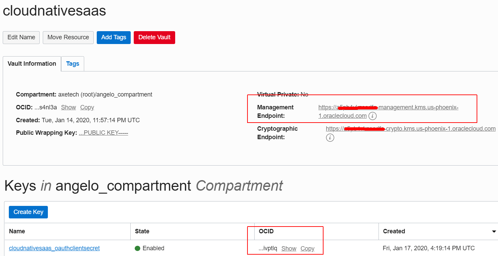

4. Once created take note of the 

   1. **cloudnativesaas_oauthsecret** key OCID     

   2.  **KMS Vault Cryptographic Endpoint** URL

      You will need these later when configuring Oracle Functions, they will be **kms_idcs_secret_key** and **kms_endpoint** respectively.

      

5. From a Linux command-line execute the following code 

   ```bash
   ENDPOINT=https://<Vault Cryptographic Endpoint>
   KEY=<cloudnativesaas_oauthsecret key OCID>> 
   
   PLAIN_TEXT=<Your IDCS APP Client Secret"
   oci kms crypto encrypt --key-id "$KEY" --endpoint "$ENDPOINT" --plaintext "$( echo $PLAIN_TEXT | base64 -w0)"
   ```

   Example Response

   ```
   {
     "data": {
       "ciphertext": "AAAAAAAAA+AAAAAAAAAAAAAAAAAAAAAAAAAAAAAAAAAAAAAAAAAAAAAAAAAAAAAAAAAAAAAAAAAAAAAAAAAAAAAAAAAAA=="
     }
   }
   ```
   
6. The output will contain the ciphertext, which is an encrypted version of the IDCS Client Secret. You will need this for later on so please take note.


#### Deploy The Functions

1. You needd to compile the sources of the *saasopportunitiesfn* Function because depends on *idcsOAuthAsserter* library. It is required to compile *idcsOAuthAsserter* library before *saasopportunitiesfn*.

   - Navigate to *idcsOAuthAsserter* directory and execute ```mvn clean install``` to generate a required dependency for *saasopportunitiesfn* Function
   - Navigate to *saasopportunitiesfn* directory and execute ```mvn clean package``` before deploy it to populate needed files for this Function in *saasopportunitiesfn/lib* directory

2. _Optional_:  You can compile the sources outside of Oracle Functions using the *maven* command within each of the functions directories(e.g. gwauthtest, idcs_ocigw and saasopportunitiesfn), by doing this you can ensure all compile and bring down any external dependencies.

   - Navigate each directory and execute ```mvn clean package```

3. Navigate to the Oracle Functions console and create a Functions Application called "***cloudnativesaas***"

   - Associate it to the VCN previously created and the appropriate public regional subnets 

4. As an optional step you you can send all the syslog debug messages to a remote syslogURL provider, e.g. [papertrail](https://papertrailapp.com/). This can be very useful for debugging any issues.

   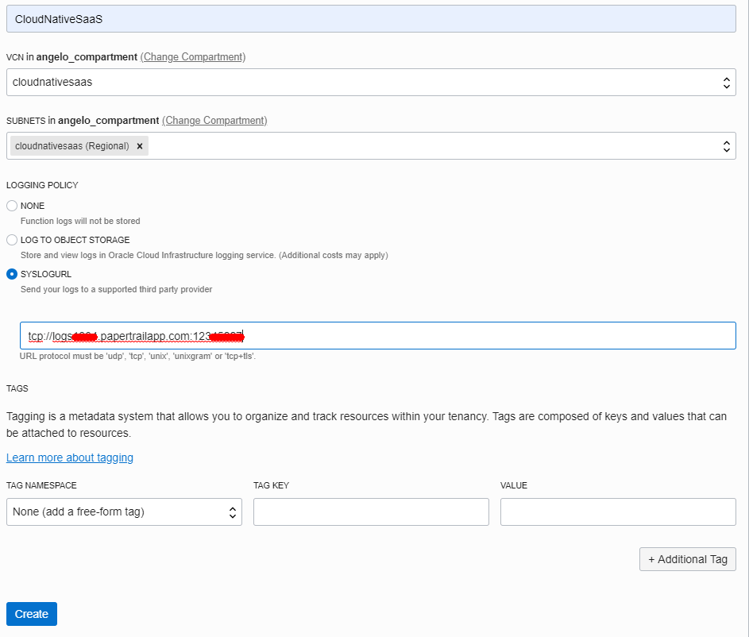
  
5. Deploy the functions to Oracle Functions using the following command ```fn deploy --all``` from within the *functions* directory. This command will read the *app.yaml* and then iterate through each _function_ subdirectory and deploy the function to the application defined it the app.yaml(i.e. cloudnativesaas) in our case.

6. Navigate to the Oracle Functions console, select the *cloudnativesaas* application and check that all the functions have been deployed and note down the individual function _OCIDs_ of all the functions.


   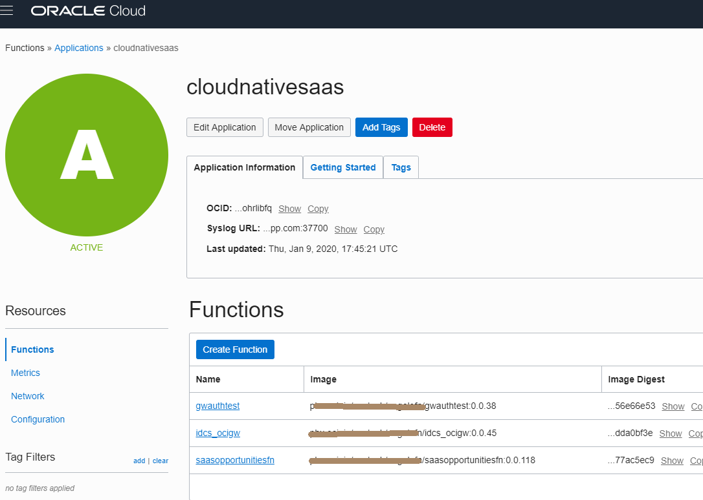


   You can also list the functions and their OCIDs using the following command

   ```shell
   fn ls functions cloudnativesaas | awk {'print Function, $1 "\t\t" $3'}
   ```

#### Configure Functions

The solution does not use configuration files to store configuration parameters but uses Oracle Functions Configuration store. 

These parameters can be modified using the console or via the command line

**Using the console**

1. Log onto the Oracle Cloud Console and navigate to the Functions section(Developer Tools/Functions). 
2. Select the *cloudnativesaas* application then select configuration(on the left hand side))
3. Within the Oracle functions application configuration, add the following configuration parameters:

|Configuration Name|Optional/Mandatory|Usage|Example|
|---|---|---|---|
|fusion_hostname|Mandatory|Contains the hostname of your Fusion Instance|e.g. https://myfainstance.fa.em2.oraclecloud.com|
|debug_jwt|Optional|Contains a valid JWT token, this can be generated from IDCS(Generate Access Token Button)||
|idcs_app_clientid|Mandatory|Your IDCS Applications Client ID|Obtained from IDCS console|
|idcs_app_secret|Mandatory|Your **encrypted** IDCS Client Secret |This was generated in the previous step after setting up the Key Management service.|
|idcs_app_url|Mandatory|The IDCS url|https://idcs-XXXXXXXXXXXX.identity.oraclecloud.com|
|idcs_app_scopeid|Mandatory|Oracle Applications Fusion Scope|You get this value from looking at the Oracle Applications(Fusion) application in IDCS, within the configuration/resource section. The field is called "primary audience", and will normally look like ```urn:opc:resource:fa:instanceid=1234567```|
|idcs_proxy_enabled|Optional|Set this to true if you have a http proxy|e.g. true or false, defaults to false|
|idcs_proxy_hosturl|Optional|e.g. http://my.proxy.com||
|debug_level|Optional|Java Debug level for logging|Can be FINE,FINEST,INFO etc|
|gtw_uri_base|Mandatory|URI to the function|This URI is the combination of the gateway URI AND the Opportunities function path.<br />e.g. /cloudnativesaas/opportunities<br />|
|kms_endpoint|Mandatory|URL to KMS Service|This is the URL to the KMS Service which can be found using the OCI Console|
|kms_idcs_secret_key|Mandatory|OCID to the KMS Secret KEY|This is the OCID to the secret key in KMS.|
|full_oauth|Optional|Use full OAuth flow instead of reuse the income JWT token from Api Gateway|*true* or *false*. By default *false*|


You can also update the configuration variables using the following script from the command line using the following commands

```shell
fn config app cloudnativesaas fusion_hostname  https://crmserver.oraclecloud.com
fn config app cloudnativesaas idcs_app_url https://idcs-myidcsserver.identity.oraclecloud.com
fn config app cloudnativesaas idcs_app_scopeid urn:opc:resource:fa:instanceid=123456
fn config app cloudnativesaas idcs_app_clientid 12345678901234567890123456789
**TODO UPDATE USING KMS**
fn config app cloudnativesaas idcs_app_secret 11111-2222-3333-4444-555555555

fn config app cloudnativesaas debug_level INFO
fn config app cloudnativesaas gtw_uri_base /cloudnativesaas/opportunities  
```
#### Configure the OCI API Gateway

OCI API gateways can be configured using a JSON configuration file or via web user interface, both methods are correct this example uses the configuration file approach which can later be introspected by the UI.

1. Locate the **cloudnativesaas_ocigw.template** file within the config directory and make a copy called **cloudnativesaas_ocigw.json**

2. Within this file you'll see it lists request policies and a list of routes for API Gateway.

3. Edit the file and enter the appropriate OCIDs for each of the functions in the correct place

   1. The CUSTOM_AUTHENTICATION policy function OCID should be set to the *idcs_ocigw* function
   2. The /opportunity routes( GET & PATCH) should be set to the *saasopportunitiesfn* function
   3. The /*gwauthtest* route should be set to the *gwauthtest* function

4. Create a API Gateway  of type **public**,within the same VCN and subnet that you deployed Oracle Functions to previously

5. Once the gateway is created(it takes a couple of seconds), enter the gateway and select "Deployments"

6. Give the API Deployment a name (e.g. cloudnativesaas) and a path prefix(e.g. /cloudnativesaas)

7. Select Upload an existing API  and drag and drop the JSON deployment file into the deployment section

8. Click next and deploy

9. Wait for the deployment to complete

10. Once the deployment has completed you can see an path prefix has been created, all of our API calls will be exposed via a combination of the API gateway endpoint and the path prefix.

## Testing
### Test 1: Check AuthTest Function works without OCI GW

From your command line execute the following command 

```shell
fn invoke cloudnativesaas gwauthtest
```

If all is working you should get the following error

```
fn invoke cloudnativesaas gwauthtest
Exception occured No Bearer token
```

This means the function was executed but no bearer token was found, and is quite correct as we have not executed the function via the OCI API gateway and not sent it a authentication token.

### Test 2: Check that simple OCI API Gateway + IDCS Authentication is working

This test checks to to see if we can connect an authenticated hello world function(*gwauthtest*) via the API gateway and display the user details. 

1. Using a REST tool(like [Postman](https://www.getpostman.com/)) create a REST request which is the API Gateway endpoint+/gwauthtest, method is GET
     The endpoint can be found within the OCI api gateway console 
     e.g.   ```GET https://xxxxxxxxxxxxxxx.apigateway.us-phoenix-1.oci.customer-oci.com/cloudnativesaas/gwauthtest```

2. Select the Authorization tab and select the type of authorization as **oAuth 2.0**

3. Select the **Get New Access Token** button

4. Enter the details for the token

  5. Grant Type = Password Credentials

     Note: We're only using password credentials within postman, within VBCS we'll be using a different OAuth scheme

  6. The Access Token URL is computed by getting the IDCS Hostname and adding /oauth2/v1/token

     e.g `https://idcs-xxxxxxxxxxxxxxxxxxxxxx.identity.oraclecloud.com/oauth2/v1/token`
     
7. Enter your username and password which you would normally use for your system. Its usually the same as you log into Fusion Applications and IDCS

8. Client ID, Client Secret and Scope as noted before when you created the confidential application.


   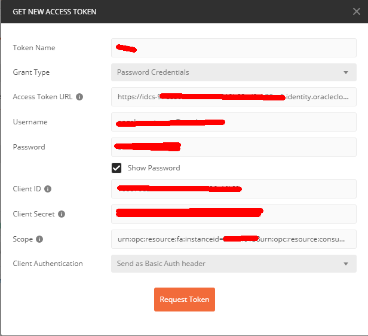

5. Select Use Token and then submit the request

When executing the function for the first time it may take a few seconds to execute, this is because the function is "cold" and we are executing not only the *gwauthtest* function but also the *idcs_ocigw* function.

If this executes OK it should return you a payload with a list of request headers AND your username in HTML Format

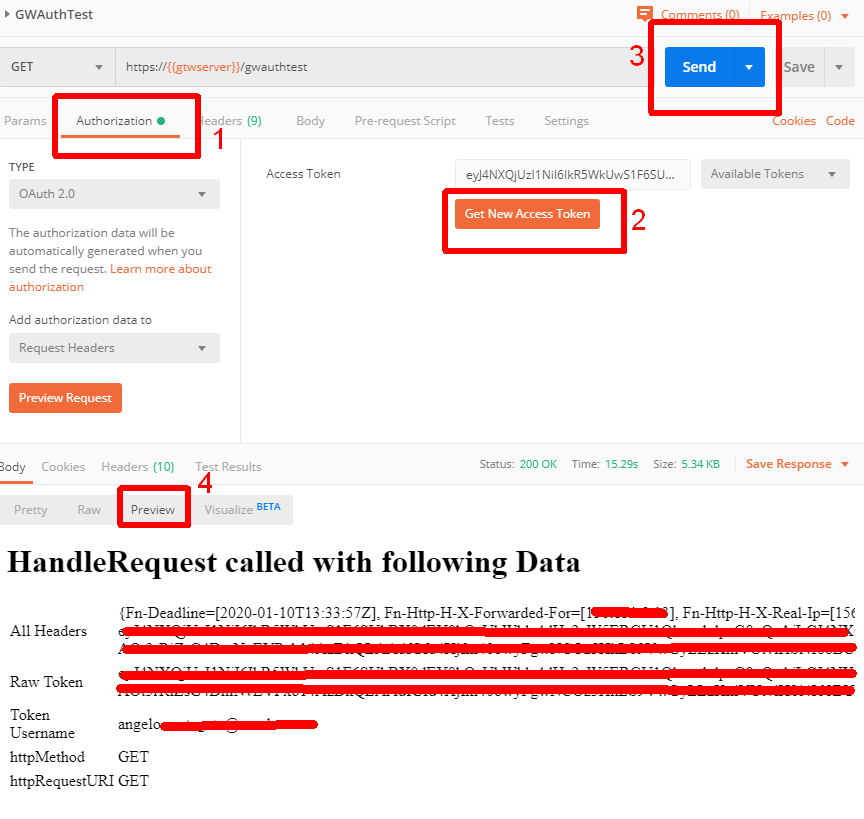

### Test 3: Query all open opportunities

The last test is to call the *saasopportunities* function and call Oracle Fusion SaaS(CRM) querying opportunities. This would then prove that you can call Oracle Fusion SaaS APIs from Functions through OCI API Gateway.

The steps are very similar to issuing the *gwauthtest* function earlier

1. Using Postman create a REST request which is the API Gateway endpoint+/opportunities, method is a GET operation

   e.g.   `GET https://xxxxxxxxxxxxxxx.apigateway.us-phoenix-1.oci.customer-oci.com/cloudnativesaas/opportunities`

2. Select the Authorization tab and select the type of authorization as oAuth 2.0

3. Select the **Get New Access Token** button.  If you have completed Test 2 then the "Get New Access Token" dialog will be prefilled, simply "Request Token" and then Use the token in the request

4. Execute the Request

   

### Installing the VBCS App

You can exercise the REST calls from either postman or from Oracle VBCS(Visual Builder Cloud Service). 


1. Download the VBCS binary zip file from github releases
   a) You can also recreate the VBCS binary zip file by zipping up the `CloudNativeSaaSVBCS` directory. Make sure the `package.json` file is in the root of the resulting zip file.
2. Import the test application into Oracle VBCS(v19.3.1 or later)


   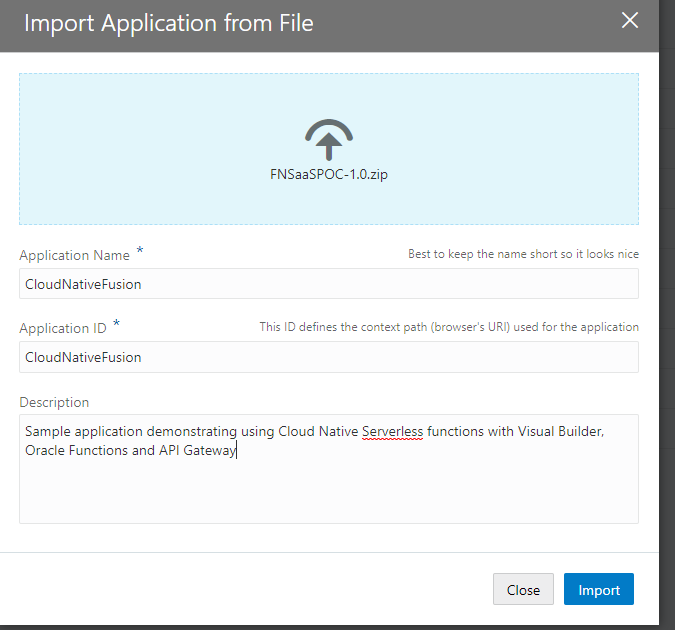
2. Navigate to the Service Connections and to the *fnsaaspoc* connection

3. Modify the Service Base URL to match your installation OCI API Gateway
   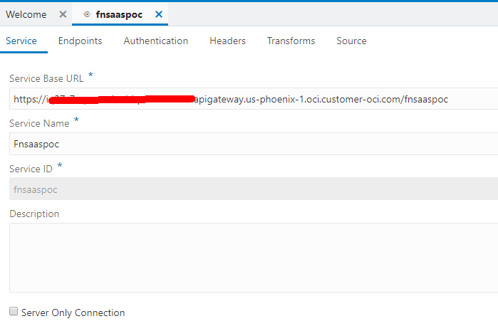

4. Open the authentication tab and modify the Authentication Mechanism so that it reflects your confidential application created at the start of this document

   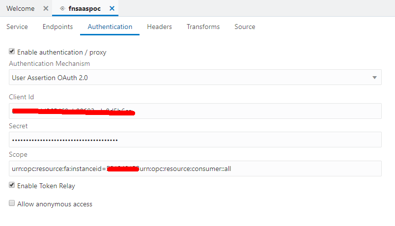

4. Run the VBCS app. The example should query all the WON,OPEN and LOST opportunities and allow you to drill down to each opportunity and set the status of a opportunity. All of this is done via a FN


Copyright(c) 2020, Oracle and/or its affiliates. All rights reserved.
Licensed under the Universal Permissive License v 1.0 as shown at https://oss.oracle.com/licenses/upl.


